#  Data Pipeline - Chatbot Documentation
---

##  Mục lục

1. [Tổng quan kiến trúc](#1-tổng-quan-kiến-trúc)
2. [Luồng dữ liệu (Data Flow)](#2-luồng-dữ-liệu-data-flow)
3. [Chi tiết từng bước](#3-chi-tiết-từng-bước)
   - [Bước 1: Khởi động Docker Services](#bước-1-khởi-docker-services)
   - [Bước 2: Khởi động Minikube](#bước-2-khởi-động-minikube)
   - [Bước 3: Deploy Hive Metastore + Trino](#bước-3-deploy-hive-metastore--trino)
   - [Bước 4: Deploy StarRocks](#bước-4-deploy-starrocks)
   - [Bước 5: Deploy Airflow](#bước-5-deploy-airflow)
   - [Bước 6: Chạy Spark ETL](#bước-6-chạy-spark-etl)
   - [Bước 7: Tạo Gold Tables](#bước-7-tạo-gold-tables)
   - [Bước 8: Chạy Gold Layer ETL](#bước-8-chạy-gold-layer-etl)
   - [Bước 9: Kết nối Superset → StarRocks](#bước-9-kết-nối-superset--starrocks)
   - [Bước 10: Tạo Charts & Dashboard](#bước-10-tạo-charts--dashboard)
4. [Kiến trúc hạ tầng](#4-kiến-trúc-hạ-tầng)
5. [Tech Stack](#5-tech-stack)

---

## 1. Tổng quan kiến trúc

### 1.1. Kiến trúc tổng thể 

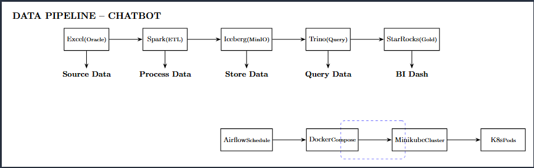

### 1.2. Mô tả các tầng

| Tầng | Thành phần | Mô tả |
|------|-----------|-------|
| **Source** | Excel (Oracle DB) | Dữ liệu chat từ Oracle DB được export ra file Excel |
| **Processing** | Apache Spark 3.5.1 | ETL xử lý dữ liệu, transform và cleansing |
| **Storage** | Iceberg on MinIO | Data Lake lưu trữ dữ liệu dạng Iceberg table |
| **Query** | Trino 435 | Query engine truy vấn dữ liệu từ Iceberg |
| **OLAP** | StarRocks 5.1.0 | Gold Layer - tổng hợp dữ liệu cho BI |
| **BI** | Apache Superset | Dashboard và Charts trực quan hóa |
| **Orchestration** | Airflow 2.10.5 | Lên lịch chạy Spark jobs tự động |

---

## 2. Luồng dữ liệu 

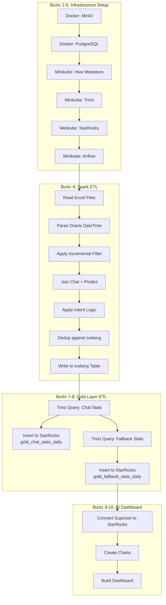

---

## 3. Chi tiết từng bước

---

### Bước 1: Khởi Docker Services

**Mục đích:** Khởi động các dịch vụ cơ bản trên Docker (MinIO, PostgreSQL, Superset)

#### Lệnh thực thi:

```bash
cd docker/
docker compose up -d minio postgres-db superset
```

#### Kết quả mong đợi:

```
[+] Running 4/4
 ✔ Network docker_default          Created    0.1s
 ✔ Container minio                 Started    0.3s
 ✔ Container postgres-db           Started    0.4s
 ✔ Container apache-superset       Started    0.5s
```

#### Kiểm tra trạng thái:

```bash
docker ps --format "table {{.Names}}\t{{.Status}}\t{{.Ports}}"
```

#### Kết quả:

```
NAMES                STATUS          PORTS
minio                Up 2 minutes    0.0.0.0:9000-9001->9000-9001/tcp
postgres-db          Up 2 minutes    0.0.0.0:5432->5432/tcp
apache-superset      Up 1 minute     0.0.0.0:8088->8088/tcp
```

#### Kiểm tra MinIO Console:

1. Mở trình duyệt: **http://localhost:9001**
2. Đăng nhập:
   - **Username:** `dtai16805`
   - **Password:** `dtai16805`

#### Kết quả MinIO Console:

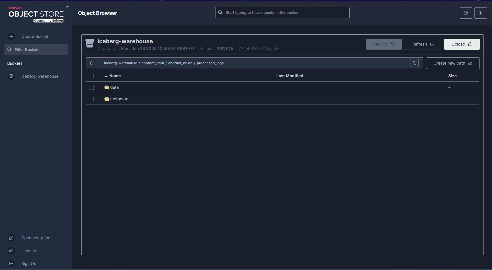

---

### Bước 2: Khởi động Minikube

**Mục đích:** Tạo Kubernetes cluster ảo để chạy các dịch vụ distributed

#### Lệnh thực thi:

```bash
minikube start --memory=8g --cpus=4
```

#### Kết quả mong đợi:

```
  Starting the "docker" driver in "docker" container
  Starting "minikube" primary control-plane (minikube) in the minikube docker cluster
  Done! kubectl is now configured to use "minikube" cluster and "minikube" default namespace
```

#### Kiểm tra trạng thái:

```bash
minikube status
```

#### Kết quả:

```
minikube
type: Control Plane
host: Running
kubelet: Running
apiserver: Running
kubeconfig: Correct
```

#### Kiểm tra resources:

```bash
kubectl get nodes
```

#### Kết quả:

```
NAME       STATUS   ROLES           AGE   VERSION
minikube   Ready    control-plane   45s   v1.30.0
```

---

### Bước 3: Deploy Hive Metastore + Trino

**Mục đích:** Triển khai Hive Metastore (metadata catalog) và Trino (query engine)

#### Lệnh thực thi:

```bash
# Tạo namespace
kubectl create namespace trino

# Deploy PostgreSQL cho Hive Metastore
kubectl apply -f kubernets/postgres.yaml

# Deploy Hive Metastore
kubectl apply -f kubernets/hive-metastore.yaml

# Deploy Trino bằng Helm
helm install trino trino/trino --namespace trino -f kubernets/trino-values.yaml
```

#### Kết quả mong đợi:

```
namespace/trino created
configmap/postgres-config created
persistentvolumeclaim/postgres-pvc created
deployment.apps/postgres created
service/postgres created
configmap/hive-metastore-config created
deployment.apps/hive-metastore created
service/hive-metastore created
NAME: trino
LAST DEPLOYED: Sun Jun 29 10:00:00 2026
NAMESPACE: trino
STATUS: deployed
```

#### Kiểm tra Pods:

```bash
kubectl get pods -n trino
```

#### Kết quả:

```
NAME                                READY   STATUS    RESTARTS   AGE
hive-metastore-7f8b9c6d4-x2k9m     1/1     Running   0          2m
postgres-5d4f8b7c9-n8j2p           1/1     Running   0          3m
trino-coordinator-544985768-psxrg  1/1     Running   0          1m
```

#### Kiểm tra Services:

```bash
kubectl get svc -n trino
```

#### Kết quả:

```
NAME              TYPE        CLUSTER-IP      EXTERNAL-IP   PORT(S)          AGE
hive-metastore    ClusterIP   10.96.123.45    <none>        9083/TCP         3m
postgres          ClusterIP   10.96.67.89     <none>        5432/TCP         4m
trino             NodePort    10.96.101.112   <none>        8081:31234/TCP   2m
```

#### Port-forward Trino:

```bash
kubectl port-forward -n trino svc/trino 8081:8080
```

#### Kết quả:

```
Forwarding from 127.0.0.1:8081 -> 8080
Forwarding from [::1]:8081 -> 8080
```

#### Kiểm tra Trino Web UI:

1. Mở trình duyệt: **http://localhost:8081**
2. Đăng nhập:
   - **Username:** `admin`
   - **Password:** `admin`

#### Kết quả Trino Web UI:

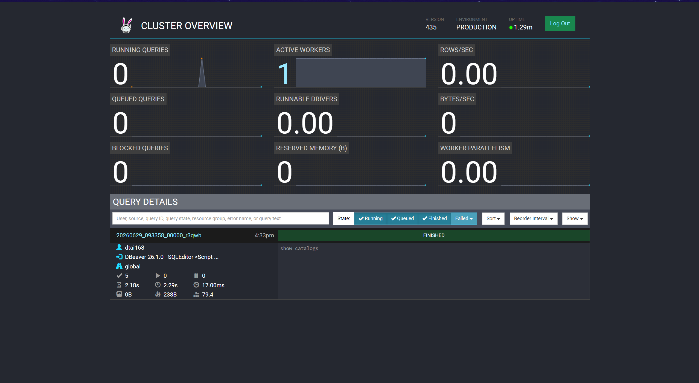

---

### Bước 4: Deploy StarRocks

**Mục đích:** Triển khai StarRocks OLAP database cho Gold Layer

#### Lệnh thực thi:

```bash
kubectl create namespace starrocks
helm install starrocks starrocks/kube-starrocks --namespace starrocks -f kubernets/starrocks-values.yaml
```

#### Kết quả mong đợi:

```
namespace/starrocks created
NAME: starrocks
LAST DEPLOYED: Sun Jun 29 10:05:00 2026
NAMESPACE: starrocks
STATUS: deployed
```

#### Kiểm tra Pods:

```bash
kubectl get pods -n starrocks
```

#### Kết quả:

```
NAME                             READY   STATUS    RESTARTS   AGE
my-starrocks-fe-0                1/1     Running   0          3m
my-starrocks-be-0                1/1     Running   0          2m
starrocks-operator-xxx           1/1     Running   0          4m
```

#### Port-forward StarRocks:

```bash
kubectl port-forward -n starrocks svc/my-starrocks-fe-service 9030:9030
```

#### Kết quả:

```
Forwarding from 127.0.0.1:9030 -> 9030
Forwarding from [::1]:9030 -> 9030
```

#### Kết nối StarRocks (DBeaver):

1. Mở DBeaver
2. Tạo kết nối mới:
   - **Database type:** MySQL
   - **Host:** `localhost`
   - **Port:** `9030`
   - **Username:** `root`
   - **Password:** *(để trống)*
   - **Database:** `gold_db`

#### Kết quả DBeaver:

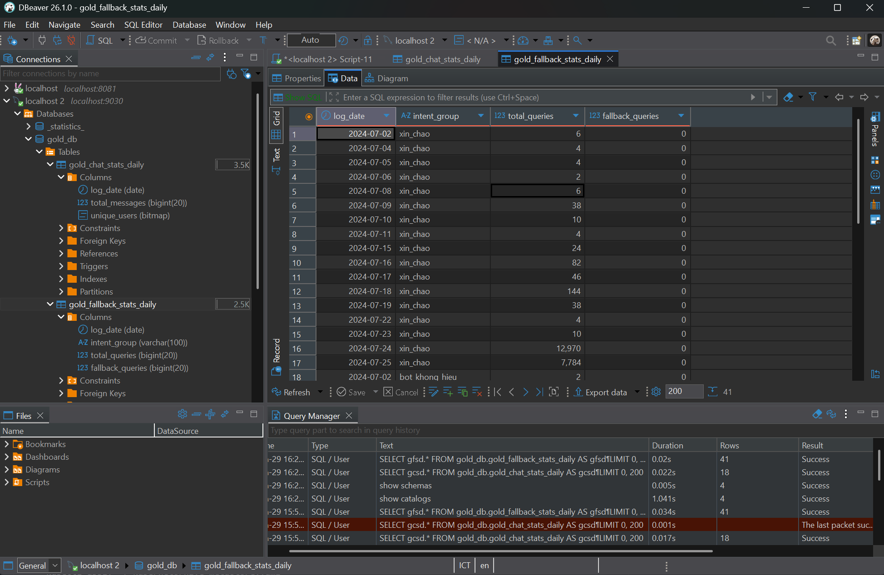
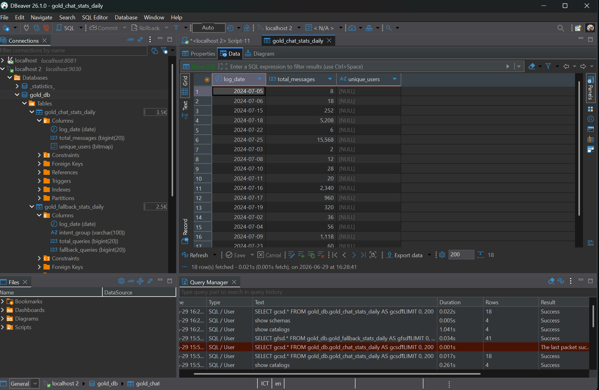

---

### Bước 5: Deploy Airflow

**Mục đích:** Triển khai Airflow để orchestrate Spark jobs

#### Lệnh thực thi:

```bash
kubectl create namespace airflow
kubectl create configmap airflow-dags --from-file=scripts/dag.py -n airflow
helm install airflow apache-airflow/airflow --namespace airflow -f kubernets/airflow-values.yaml
```

#### Kết quả mong đợi:

```
namespace/airflow created
configmap/airflow-dags created
NAME: airflow
LAST DEPLOYED: Sun Jun 29 10:10:00 2026
NAMESPACE: airflow
STATUS: deployed
```

#### Kiểm tra Pods:

```bash
kubectl get pods -n airflow
```

#### Kết quả:

```
NAME                                  READY   STATUS    RESTARTS   AGE
airflow-webserver-xxx                 1/1     Running   0          5m
airflow-scheduler-xxx                 1/1     Running   0          5m
airflow-postgres-xxx                  1/1     Running   0          6m
airflow-redis-xxx                     1/1     Running   0          6m
```

#### Port-forward Airflow:

```bash
kubectl port-forward -n airflow svc/airflow-webserver 8080:8080
```

#### Kết quả:

```
Forwarding from 127.0.0.1:8080 -> 8080
Forwarding from [::1]:8080 -> 8080
```

#### Kiểm tra Airflow Web UI:

1. Mở trình duyệt: **http://localhost:8080**
2. Đăng nhập:
   - **Username:** `admin`
   - **Password:** `admin`

#### Kết quả Airflow Web UI:

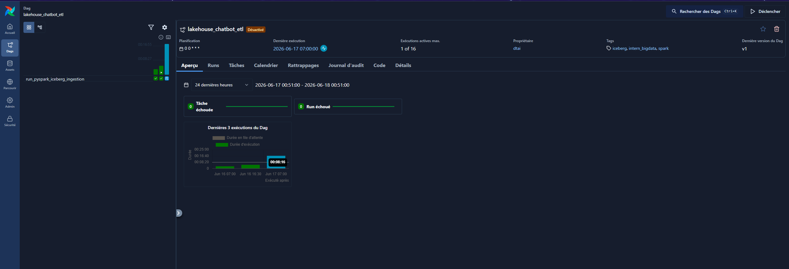

---

### Bước 6: Chạy Spark ETL

**Mục đích:** Đọc dữ liệu từ Excel, xử lý và ghi vào Iceberg table

#### Lệnh thực thi:

```bash
python scripts/spark.py
```

#### Kết quả mong đợi:

```
--> Last checkpoint: None
--> Reading Excel files with pandas...
    chat rows: 15234, predict rows: 18921
--> Joining and applying intent logic...
    merged rows: 18921
--> Writing 18921 records to iceberg.chatbot_v2.processed_logs...
    Writing Parquet to C:\Users\dtai168\AppData\Local\Temp\chatbot_etl\batch.parquet...
    Creating table iceberg.chatbot_v2.processed_logs...
--> Checkpoint saved at 2026-06-28 23:58:45
--> Done.
```


#### Kiểm tra dữ liệu trong MinIO:

1. Mở MinIO Console: **http://localhost:9001**
2. Vào bucket: `iceberg-warehouse`
3. Kiểm tra thư mục: `chatbot_data/chatbot_v2/processed_logs`

#### Kết quả MinIO:

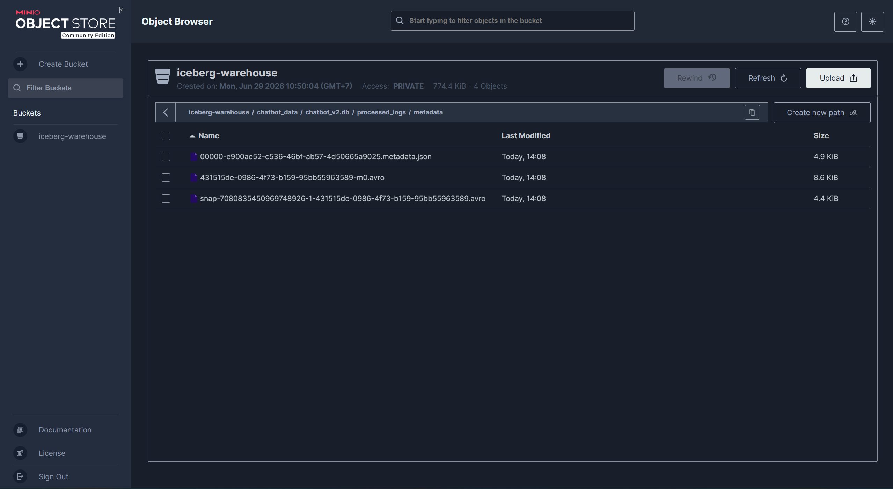
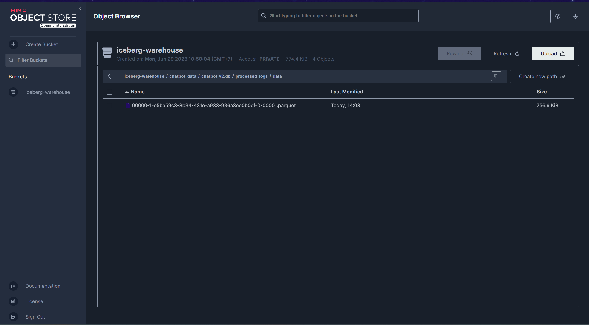

#### Kiểm tra dữ liệu qua Trino:

```sql
-- Kết nối DBeaver vào Trino (localhost:8081)
-- Database type: Trino
-- Host: localhost
-- Port: 8081
-- Catalog: iceberg

-- Kiểm tra số dòng
SELECT COUNT(*) AS total_rows 
FROM iceberg.chatbot_v2.processed_logs;
```

#### Kết quả:

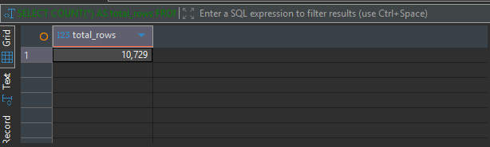

```sql
-- Xem mẫu dữ liệu
SELECT id, sender_id, final_intent, created_time 
FROM iceberg.chatbot_v2.processed_logs 
LIMIT 10;
```

#### Kết quả:

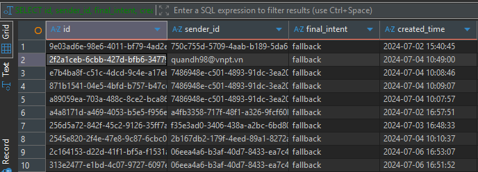

---

### Bước 7: Tạo Gold Tables

**Mục đích:** Tạo các bảng Gold trong StarRocks để tổng hợp dữ liệu

#### Lệnh thực thi:

```sql
-- Kết nối DBeaver vào StarRocks (localhost:9030)

-- Bước 1: Tạo database
CREATE DATABASE IF NOT EXISTS gold_db;

-- Bước 2: Tạo Gold Tables
CREATE TABLE gold_db.gold_chat_stats_daily (
    log_date        DATE            COMMENT 'Ngày thống kê',
    total_messages  BIGINT SUM DEFAULT "0" COMMENT 'Tổng số tin nhắn',
    unique_users    BITMAP BITMAP_UNION COMMENT 'User duy nhất (bitmap)'
)
AGGREGATE KEY(log_date)
DISTRIBUTED BY HASH(log_date) BUCKETS 3
PROPERTIES ("replication_num" = "1");

CREATE TABLE gold_db.gold_fallback_stats_daily (
    log_date        DATE            COMMENT 'Ngày thống kê',
    intent_group    VARCHAR(100)    COMMENT 'Nhóm ý định',
    total_queries   BIGINT SUM DEFAULT "0" COMMENT 'Tổng câu hỏi',
    fallback_queries BIGINT SUM DEFAULT "0" COMMENT 'Số fallback'
)
AGGREGATE KEY(log_date, intent_group)
DISTRIBUTED BY HASH(intent_group) BUCKETS 3
PROPERTIES ("replication_num" = "1");
```

#### Kết quả mong đợi:

```
Query OK, 1 row affected (0.02 sec)

Query OK, 0 rows affected (0.01 sec)

Query OK, 0 rows affected (0.01 sec)
```

#### Kiểm tra tables:

```sql
SHOW DATABASES
USE gold_db
SHOW TABLES;
```

#### Kết quả:

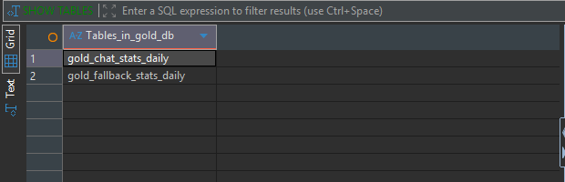

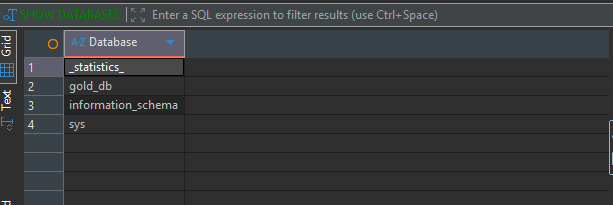

#### Kiểm tra cấu trúc table:

```sql
DESCRIBE gold_db.gold_chat_stats_daily;
```

#### Kết quả:

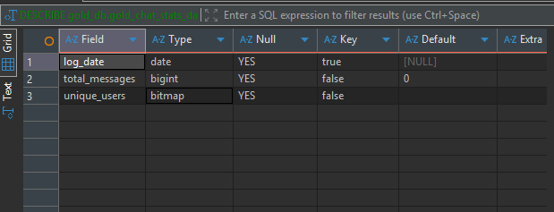

---

### Bước 8: Chạy Gold Layer ETL

**Mục đích:** Trích xuất dữ liệu từ Iceberg qua Trino và tải vào StarRocks Gold tables

#### Lệnh thực thi:

```bash
# Port-forward StarRocks trước
kubectl port-forward -n starrocks svc/my-starrocks-fe-service 9030:9030

# Chạy ETL
python scripts/etl_gold.py
```

#### Kết quả mong đợi:

```
StarRocks Gold ETL
StarRocks: 127.0.0.1:9030
Trino pod: trino-coordinator-544985768-psxrg

=== ETL: gold_chat_stats_daily ===
  Got 45 rows from Trino
  2024-07-02: 342 msgs, 89 users -> OK
  2024-07-03: 456 msgs, 112 users -> OK
  2024-07-04: 389 msgs, 95 users -> OK
  ...
  2024-08-15: 512 msgs, 134 users -> OK

=== ETL: gold_fallback_stats_daily ===
  Got 180 rows from Trino
  2024-07-02 | hoi_dich_vu: 156 total, 12 fallback -> OK
  2024-07-02 | fallback: 45 total, 45 fallback -> OK
  2024-07-02 | hoi_gia: 89 total, 8 fallback -> OK
  ...
  2024-08-15 | hoi_don_hang: 123 total, 15 fallback -> OK

=== VERIFY: Gold Tables ===

  gold_chat_stats_daily: 45 rows
    ['log_date', 'total_messages', 'unique_users']
    (datetime.date(2024, 7, 2), 342, 'Bitmap')
    (datetime.date(2024, 7, 3), 456, 'Bitmap')
    (datetime.date(2024, 7, 4), 389, 'Bitmap')
    ...

  gold_fallback_stats_daily: 180 rows
    ['log_date', 'intent_group', 'total_queries', 'fallback_queries']
    (datetime.date(2024, 7, 2), 'fallback', 45, 45)
    (datetime.date(2024, 7, 2), 'hoi_dich_vu', 156, 12)
    (datetime.date(2024, 7, 2), 'hoi_gia', 89, 8)
    ...

=== DONE ===
```

#### Giải thích luồng xử lý:

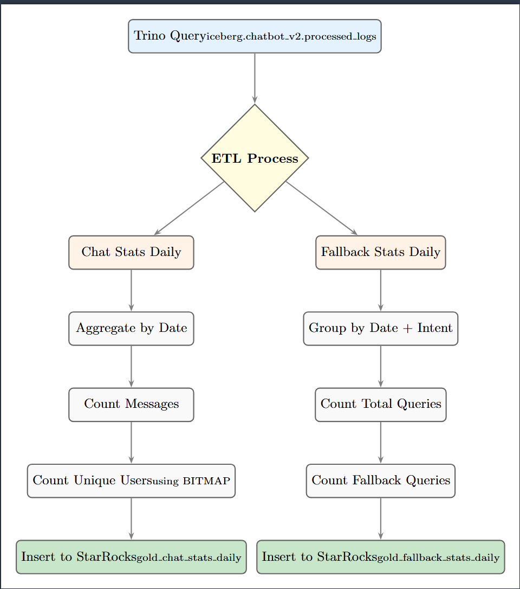

#### Kiểm tra dữ liệu Gold:

```sql
-- Trong DBeaver (StarRocks localhost:9030)

-- 1. Thống kê chat theo ngày
SELECT log_date, total_messages, BITMAP_COUNT(unique_users) AS unique_users
FROM gold_db.gold_chat_stats_daily
ORDER BY log_date;
```

#### Kết quả:

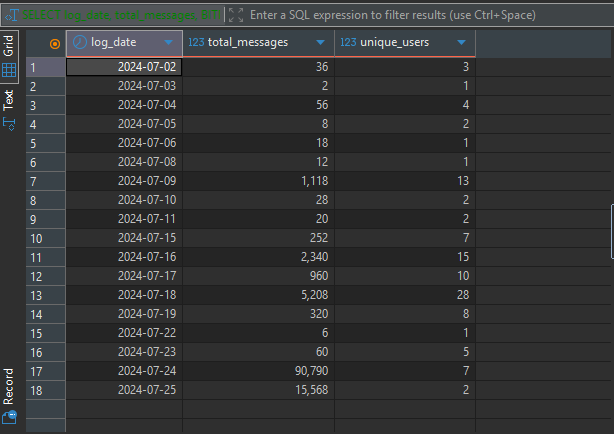

```sql
-- 2. Tỷ lệ fallback theo intent
SELECT intent_group, 
       SUM(total_queries) AS total,
       SUM(fallback_queries) AS fallback,
       ROUND(SUM(fallback_queries) * 100.0 / SUM(total_queries), 2) AS fallback_pct
FROM gold_db.gold_fallback_stats_daily
GROUP BY intent_group
ORDER BY total DESC;
```

#### Kết quả:

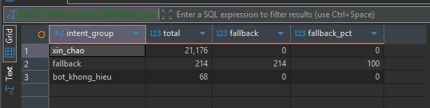

---

### Bước 9: Kết nối Superset → StarRocks

**Mục đích:** Kết nối Apache Superset với StarRocks để tạo dashboard

#### Lệnh thực thi:

1. Mở Superset: **http://localhost:8088**
2. Đăng nhập:
   - **Username:** `admin`
   - **Password:** `admin`

3. Vào **Settings** → **Data** → **Databases** → **+ Database**

4. Nhập thông tin kết nối:
   - **Database Name:** `StarRocks Gold`
   - **SQLAlchemy URI:** `mysql+pymysql://root@host.docker.internal:9030/gold_db`

5. Nhấn **Test Connection** → **Connect**

#### Kiểm tra trong Superset:

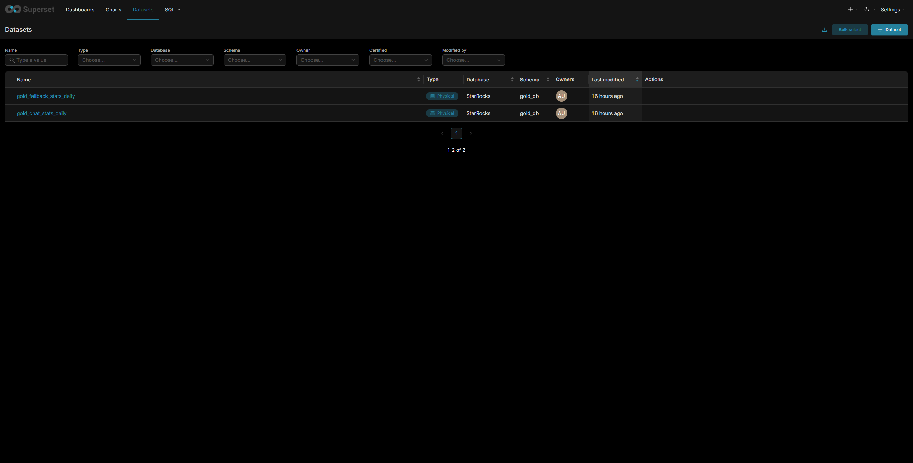

---

### Bước 10: Tạo Charts & Dashboard

**Mục đích:** Tạo các biểu đồ trực quan hóa từ dữ liệu Gold

#### Chart 1: Chat theo ngày (Line Chart)

**SQL Query:**

```sql
SELECT log_date, total_messages 
FROM gold_db.gold_chat_stats_daily 
ORDER BY log_date;
```

#### Kết quả:

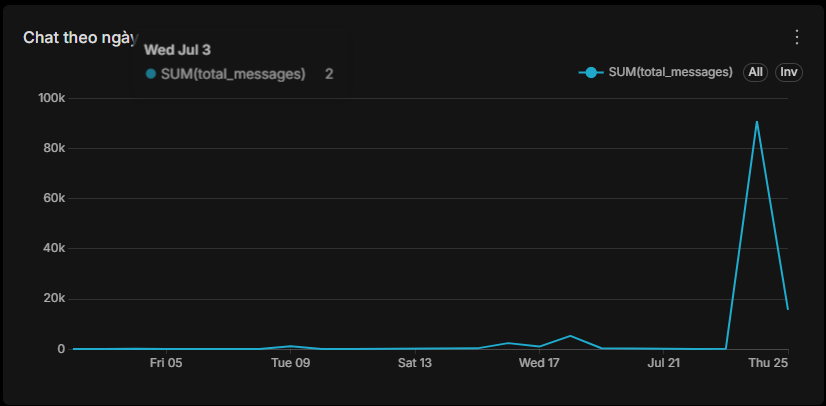

#### Chart 2: Top Intent (Bar Chart)

**SQL Query:**

```sql
SELECT intent_group, SUM(total_queries) AS total
FROM gold_db.gold_fallback_stats_daily 
GROUP BY intent_group 
ORDER BY total DESC;
```

#### Kết quả:

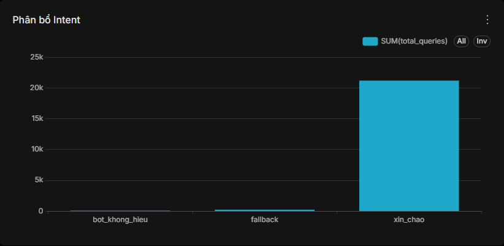

#### Chart 3: Tỷ lệ fallback (Pie Chart)

**SQL Query:**

```sql
SELECT intent_group, SUM(total_queries) AS total
FROM gold_db.gold_fallback_stats_daily 
GROUP BY intent_group;
```

#### Kết quả:

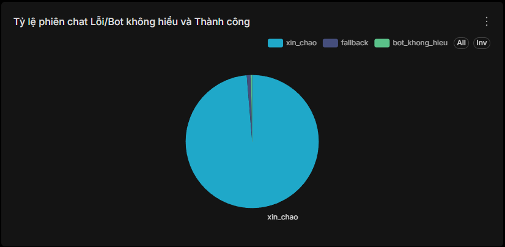

#### Dashboard Tổng hợp:

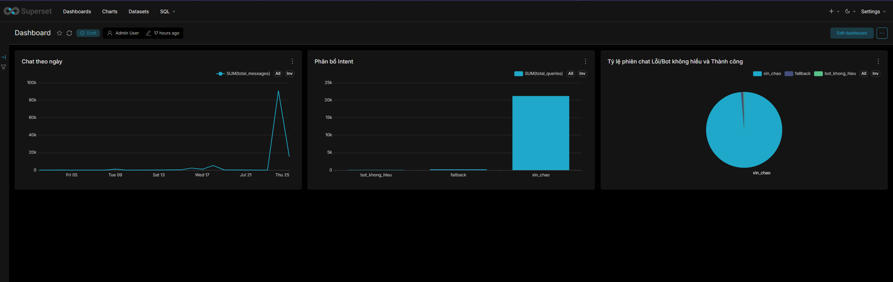

---

## 4. Kiến trúc hạ tầng

### 4.1. Phân bổ nền tảng

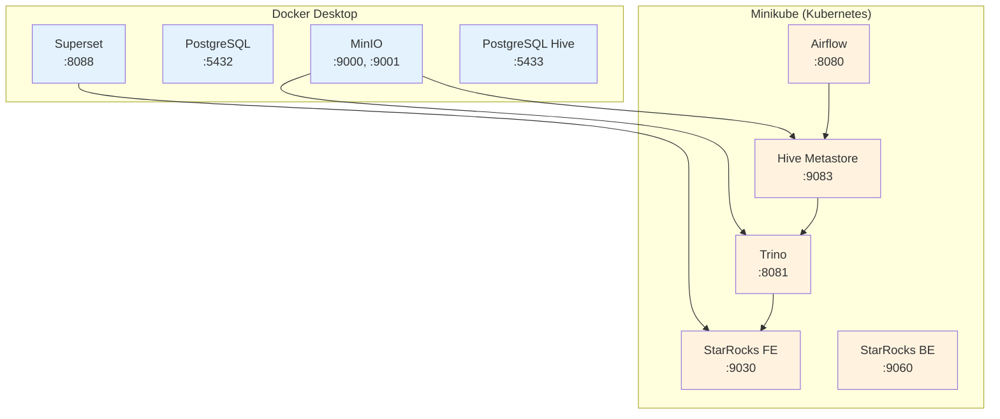

---

## 5. Tech Stack

| Thành phần | Công nghệ | Phiên bản | Mục đích |
|-----------|-----------|----------|----------|
| Data Lake | MinIO (S3) | Latest | Lưu trữ Iceberg tables |
| Processing | Apache Spark | 3.5.1 | ETL, xử lý dữ liệu |
| Catalog | Hive Metastore | 4.0.0 | Đăng ký table metadata |
| Query Engine | Trino | 435 | Query Iceberg |
| OLAP | StarRocks | 3.3 | Gold Layer, tổng hợp nhanh |
| BI | Apache Superset | Latest | Dashboard & Charts |
| Orchestration | Apache Airflow | 2.10.5 | Schedule Spark jobs |
| Container | Docker Desktop | — | Local services |
| Cluster | Kubernetes (Minikube) | — | Production-like K8s |
| Database | PostgreSQL | 15 | Hive Metastore backend |

---

## 📝 Ghi chú

### URLs tham khảo

| Dịch vụ | URL | Ghi chú |
|---------|-----|---------|
| MinIO Console | http://localhost:9001 | Quản lý Data Lake |
| Superset | http://localhost:8088 | BI Dashboard |
| Trino Web UI | http://localhost:8081 | Query Engine UI |
| Airflow | http://localhost:8080 | Orchestration UI |
| StarRocks | localhost:9030 (MySQL) | OLAP Database |

### Credentials

| Dịch vụ | Username | Password |
|---------|----------|----------|
| MinIO | dtai16805 | dtai16805 |
| Superset | admin | admin |
| Trino | admin | admin |
| Airflow | admin | admin |
| StarRocks | root | *(trống)* |
| PostgreSQL | postgres | postgres |

---

